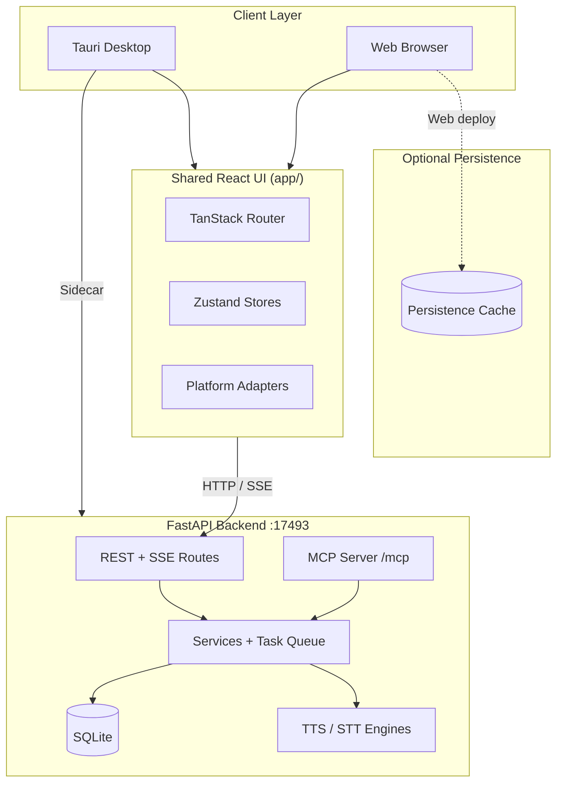
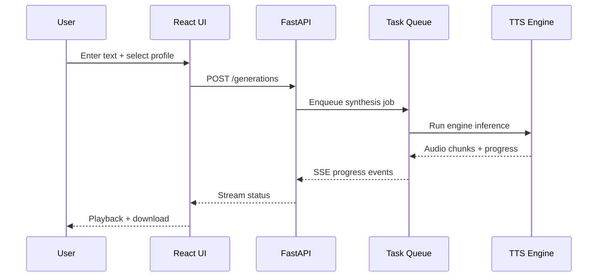

# Voicebox

Local-first AI voice studio — clone voices, synthesize speech, dictate into any application, and connect MCP agents to custom voices. All inference runs on your hardware; audio never leaves your machine unless you explicitly configure remote access.

> **Version 0.5.0** · Bun monorepo · FastAPI backend · Tauri desktop · React UI

---

## Table of Contents

- [Overview](#overview)
- [Architecture](#architecture)
- [Feature Highlights](#feature-highlights)
- [Project Structure](#project-structure)
- [Installation](#installation)
- [Configuration](#configuration)
- [Development](#development)
- [Testing](#testing)
- [Troubleshooting](#troubleshooting)
- [Contributing](#contributing)
- [FAQ](#faq)
- [License](#license)

---

## Overview

Voicebox combines voice **input** (Whisper STT + global dictation hotkey) and voice **output** (seven TTS engines with cloning, effects, and chunking) in a single application. A bundled local LLM refines transcripts and drives per-profile personas.

| Surface | Stack | Purpose |
|---------|-------|---------|
| Desktop app | Tauri 2 + Rust | Native hotkeys, audio I/O, sidecar management |
| Shared UI | React 18 + TypeScript | Studio interface shared by desktop and web |
| Backend | FastAPI + Python | TTS/STT engines, SQLite, MCP server |
| Web deploy | Vite + optional persistence cache | Browser-accessible build for self-hosting |
| Marketing | Next.js | Public site at [voicebox.sh](https://voicebox.sh) |
| Docs | Fumadocs | Developer documentation |

---

## Architecture

### System Context



### Request Flow — Speech Generation



### Platform Abstraction

Native capabilities (filesystem, updater, audio capture) are defined in `app/src/platform/types.ts`. Each deployment target provides its own implementation:

- **Desktop** — `tauri/src/platform/` (full native access)
- **Web** — `web/src/platform/` (browser-safe stubs)

---

## Feature Highlights

- **Seven TTS engines** — Qwen3-TTS, Qwen CustomVoice, LuxTTS, Chatterbox Multilingual/Turbo, HumeAI TADA, Kokoro
- **Voice cloning** — Zero-shot cloning from a short reference sample
- **23 languages** — Multilingual synthesis across major language families
- **Global dictation** — System-wide hotkey with paste-into-focused-field
- **Audio effects** — Pitch, reverb, delay, chorus, compression, filters
- **MCP integration** — HTTP MCP server for agent-driven voice workflows
- **Local LLM refinement** — Bundled Qwen3 model for transcript cleanup
- **Optional persistence cache** — Session and deployment persistence for web hosting

---

## Project Structure

```
voicebox/
├── app/                 # Shared React application
├── tauri/               # Desktop shell (Vite + Rust)
├── web/                 # Browser deployment wrapper
│   └── src/server/      # Node persistence bootstrap
├── landing/             # Marketing site
├── docs/                # Documentation site (standalone install)
├── backend/             # Python FastAPI server
│   ├── routes/          # HTTP routers
│   ├── services/        # Business logic
│   ├── backends/        # TTS/STT engine implementations
│   └── mcp_server/      # MCP tools
├── src/                 # Root TypeScript utilities and runtime modules
│   └── redis/           # Persistence connection manager + cache API
├── scripts/             # Build and release automation
├── docs/internal/       # Engineering audit notes
├── biome.json           # Lint + format (JS/TS)
└── justfile             # Primary dev orchestration
```

Design rationale and workspace boundaries are documented in [`docs/internal/STRUCTURE.md`](docs/internal/STRUCTURE.md).

---

## Installation

### Prerequisites

| Tool | Version | Notes |
|------|---------|-------|
| [Bun](https://bun.sh) | ≥ 1.0 | JavaScript package manager |
| Python | ≥ 3.12 | Backend runtime |
| Rust | stable | Required for Tauri desktop builds |
| FFmpeg | any recent | Audio processing |

### Quick Setup (recommended)

```bash
# Clone and enter the repository
git clone https://github.com/jamiepine/voicebox.git
cd voicebox

# Install Python venv, GPU-aware torch, and JS dependencies
just setup

# Start backend + desktop app
just dev
```

### Docker (web UI + API)

```bash
docker compose up --build
# API available at http://127.0.0.1:17600
```

Docker Compose includes an optional cache service (Redis) for web deployment persistence.

### Desktop Release

Download pre-built binaries from [GitHub Releases](https://github.com/jamiepine/voicebox/releases) for macOS, Windows, and Linux.

---

## Configuration

### Backend

| Variable | Default | Description |
|----------|---------|-------------|
| `VOICEBOX_HOST` | `127.0.0.1` | API bind address |
| `VOICEBOX_PORT` | `17493` | API port |
| `VOICEBOX_CORS_ORIGINS` | — | Comma-separated extra CORS origins |
| `LOG_LEVEL` | `info` | Python logging level |

### Persistence Cache (optional — web deployments)

| Variable | Default | Description |
|----------|---------|-------------|
| `VOICEBOX_REDIS_ENABLED` | `false` | Enable Redis persistence |
| `VOICEBOX_REDIS_URL` | — | Full connection URL |
| `VOICEBOX_REDIS_HOST` | `127.0.0.1` | Host when URL not set |
| `VOICEBOX_REDIS_PORT` | `6379` | Port |
| `VOICEBOX_REDIS_KEY_PREFIX` | `voicebox:` | Key namespace |

See [`.env.redis.example`](.env.redis.example) for the full list.

When the persistence cache is disabled or unreachable, the connection manager transparently falls back to in-memory storage.

### MCP Client

Point your MCP client at `http://127.0.0.1:17493/mcp`. Example configuration is in `.mcp.json`.

---

## Development

### Common Commands

```bash
just dev              # Backend + Tauri desktop
bun run dev:web       # Web UI only (start backend separately)
bun run dev:server    # FastAPI with hot reload
bun run typecheck     # TypeScript across all workspaces
bun run check         # Biome lint + format
bun run test          # TypeScript persistence unit tests
just test             # Python pytest suite
just check            # Biome + Ruff
```

### API Code Generation

After changing backend routes, regenerate the OpenAPI client:

```bash
bun run generate:api
```

### Adding a TTS Engine

Follow the agent skill at `.agents/skills/add-tts-engine/SKILL.md` and mirror patterns in `backend/backends/`.

---

## Testing

| Layer | Command | Framework |
|-------|---------|-----------|
| TypeScript | `bun run test` | Vitest (TypeScript persistence tests) |
| TypeScript | `bun run typecheck` | tsc strict mode |
| Python | `just test` | pytest |
| Rust | `cargo test` (in `tauri/src-tauri`) | cargo test |
| CI | `bun run ci` | typecheck + biome + vitest + web build |

```bash
# Run everything locally before opening a PR
bun run ci && just test
```

---

## Troubleshooting

### Backend won't start

1. Confirm Python 3.12+ and an activated virtualenv (`just setup`).
2. Check port 17493 is free: `curl http://127.0.0.1:17493/health`.
3. Review logs — GPU driver issues often appear during torch model load.

### Tauri dev compile fails (missing sidecar)

Run `bun run setup:dev` to create placeholder sidecar binaries, then start the real server with `bun run dev:server`.

### Web build type errors

Run `bun run typecheck` from the repository root. All workspaces (`app`, `web`, `tauri`, `landing`) plus root `src/` are included.

### Persistence connection errors

Set `VOICEBOX_REDIS_ENABLED=false` to use in-memory fallback, or verify the cache backend is reachable:

```bash
docker run --rm -p 6379:6379 redis:7-alpine
export VOICEBOX_REDIS_ENABLED=true
bun run bootstrap:persistence
```

### Model download failures

Ensure sufficient disk space and network access for HuggingFace downloads. Set `HF_TOKEN` for gated models.

Extended guides: [docs.voicebox.sh](https://docs.voicebox.sh) → Troubleshooting.

---

## Contributing

1. Fork the repository and create a feature branch from `main`.
2. Run `just setup` if this is your first contribution.
3. Follow existing conventions — Biome for TS, Ruff for Python.
4. Ensure `bun run ci` and `just test` pass before opening a PR.
5. Update documentation when changing user-facing behavior.

See [`CONTRIBUTING.md`](CONTRIBUTING.md) for coding standards and review expectations.

---

## FAQ

**Is my voice data sent to the cloud?**  
No. By default all models and audio remain on your machine. Remote mode requires explicit configuration.

**Which GPU is supported?**  
NVIDIA CUDA, Apple MLX (macOS), AMD ROCm (Windows/Linux overlay), and CPU fallback.

**Can I use Voicebox as an API server?**  
Yes. The FastAPI backend exposes a full REST API documented at `/docs` when running. Bind beyond localhost only on trusted networks.

**Why optional persistence cache?**  
The cache layer is optional and primarily benefits self-hosted web deployments that need shared session or cache state across processes.

**How does this differ from ElevenLabs or Wispr Flow?**  
Voicebox is open source, runs locally, and covers both speech synthesis and dictation in one stack with MCP agent integration.

---

## License

See [`LICENSE`](LICENSE) for details.

---

**Links:** [Website](https://voicebox.sh) · [Documentation](https://docs.voicebox.sh) · [Releases](https://github.com/jamiepine/voicebox/releases) · [Security Policy](SECURITY.md)
